# 🌌 NGODS 2025 Lakehouse Stack

Plataforma local de **data lakehouse** lista para ingeniería de datos moderna. Este stack combina almacenamiento S3 compatible, catálogo Iceberg/Hive, ejecución de Spark, SQL interactivo con Trino, orquestación con Dagster y transformaciones con dbt; todo empaquetado en contenedores y pensado para emular un entorno productivo.

> 🧪 **Versión del stack:**  
> • MinIO `latest`  
> • MariaDB `10.11`  
> • Hive Metastore `3.1.3`  
> • Apache Spark Thrift `3.3.2` + Iceberg `1.4.3`  
> • Trino `475`  
> • Dagster `1.9.10`  
> • dbt Core `1.9.2`  
> • Docker Compose compatible `≥ 2.20`

---

## 📜 Índice
- [⚡ Requisitos](#-requisitos)
- [🚀 Instalación y arranque](#-instalación-y-arranque)
- [🧱 Arquitectura](#-arquitectura)
- [🌿 Variables de entorno](#-variables-de-entorno)
- [🧰 Comandos útiles](#-comandos-útiles)
- [☁️ MinIO & Lago](#-minio--lago)
- [🔥 Spark · Hive · Iceberg](#-spark--hive--iceberg)
- [🪬 Dagster & dbt](#-dagster--dbt)
- [🛠 Troubleshooting](#-troubleshooting)
- [📝 Changelog](#-changelog)

---

## ⚡ Requisitos

- Docker Engine ≥ 24  
- Docker Compose ≥ 2.20  
- Red Docker previa `ngodsnet` (externa, se crea una única vez)

---

## 🚀 Instalación y arranque

```bash
# Clonar el repositorio
git clone https://github.com/tu_usuario/NGODS-2025.git
cd NGODS-2025

# Crear la red externa usada por todo el stack (solo la primera vez)
docker network create ngodsnet

# Inicializar buckets, catálogos y servicios base
docker compose up -d mariadb metastore minio minio-setup

# Levantar el resto de servicios (Spark, Trino, Dagster, dbt runner)
docker compose up -d
```

📍 **UIs principales:**  
• Dagster Webserver: [http://localhost:3000](http://localhost:3000)  
• MinIO Console: [http://localhost:9001](http://localhost:9001)  
• Trino Web UI: [http://localhost:8081](http://localhost:8081)

🔑 **Credenciales por defecto:** `minio / MinioPass_2025!` en MinIO, `hive / hivepass` en MariaDB (solo servicios internos). Cámbialas para producción.

---

## 🧱 Arquitectura

### Visión de servicios y conectores


- **MinIO** centraliza el almacenamiento bruto, landing y capas refinadas.  
- **Hive Metastore** ejecutándose sobre MariaDB almacena el catálogo Iceberg y lo comparte con Spark y Trino.  
- **Dagster** vigila el bucket `ingest/` mediante sensores S3, orquesta el pipeline y registra tablas en el catálogo a través de Spark.  
- **Spark Thrift** expone JDBC y UI, escribe/lee en MinIO con driver `s3a` y aplica los paquetes de Iceberg.  
- **dbt Runner** dispone de perfiles preconfigurados para apuntar tanto a Spark como a Trino, reutilizando los mismos catálogos.  
- **Trino** consulta Iceberg en MinIO gracias al Hive Metastore y expone UI/API para analytics ad-hoc.

### Flujo de datos end-to-end

```mermaid
sequenceDiagram
  participant U as Usuario
  participant S3 as Bucket ingest/
  participant Sen as Sensor Dagster
  participant Job as Job ingest_silver
  participant Sp as Spark/Iceberg
  participant Cat as Hive Catalog
  participant SQL as Trino/dbt

  U->>S3: Subir Excel/CSV vía scripts o consola
  Sen-->>S3: Escaneo incremental (S3 ListObjects)
  Sen->>Job: RunRequest con metadata (key, timestamp)
  Job->>S3: Descarga objeto y valida formato
  Job->>Sp: Convierte a Parquet particionado y sube a silver/
  Sp->>Cat: Registra/crea tabla Iceberg en MariaDB
  Job->>Job: Ejecuta `dbt build`
  SQL-->>Cat: Resuelve esquema Iceberg actualizado
  SQL-->>S3: Ejecuta consultas interactuando con los Parquet
```



Este recorrido cubre de **landing** (Excel/CSV) a **capa Silver** optimizada y consultable. El job secundario `organize_parquet` reorganiza y compacta los ficheros generados por otras ingestas manteniendo particiones por hora.

---

## 🌿 Variables de entorno

Los valores viven en `.env`. Ajusta credenciales y prefijos antes de exponer el stack.

```env
COMPOSE_PROJECT_NAME=ngods
NETWORK_NAME=ngodsnet

DB_HOST=mariadb
DB_PORT=3306
DB_ROOT_PASSWORD=admin123
DB_NAME=metastore_db
DB_USER=hive
DB_PASSWORD=hivepass

MINIO_ROOT_USER={user}
MINIO_ROOT_PASSWORD={password}
S3_BUCKET=ngods
S3_ENDPOINT=http://minio:9000
AWS_REGION=us-east-1

SPARK_VERSION=3.3.2
TRINO_VERSION=475
PYTHON_IMAGE=python:3.10-slim-bookworm

INGEST_PREFIX=ingest/
BRONZE_PREFIX=bronze/
SILVER_PREFIX=silver/
```

🔐 **Recomendaciones para producción:**

1. Genera usuarios/contraseñas únicos para MinIO y MariaDB.  
2. Cambia los nombres de bucket y prefijos (`S3_BUCKET`, `INGEST_PREFIX`, `SILVER_PREFIX`).  
3. Restringe la red Docker a máquinas de confianza y aplica TLS/SSL en el endpoint S3 si sale a Internet.  
4. Ajusta el catálogo `dbt` (schema/catalog) según tus políticas de naming.

---

## 🧰 Comandos útiles

```bash
# Ver el estado de los contenedores
docker compose ps

# Seguir logs en tiempo real (ej. Dagster daemon)
docker compose logs -f dagster-daemon

# Ejecutar un job de Dagster manualmente
docker compose exec dagster-webserver dagster job launch -m dagster_jobs -j ingest_silver_job

# Lanzar transformaciones dbt (perfil trino por defecto)
docker compose exec dbt-runner dbt build --profiles-dir /root/.dbt

# Abrir un shell de Spark SQL vía beeline
docker compose exec spark-thrift beeline -u 'jdbc:hive2://spark-thrift:10000/;transportMode=binary'

# Detener y limpiar todo (incluyendo volúmenes)
docker compose down -v
```

📦 **Generador de datos de ejemplo:**

```bash
python -m venv generador-datos/.venv
source generador-datos/.venv/bin/activate  # Windows: .venv\\Scripts\\activate
pip install -r generador-datos/requirements.txt

export MINIO_ENDPOINT="http://localhost:9000"
export MINIO_ACCESS_KEY="tu_password"
export MINIO_SECRET_KEY="tu_password"
export S3_BUCKET="ngods"
export S3_PREFIX="ingest"

python generador-datos/generate_and_upload_excel.py --num-files 100 --rows 50
```

---

## ☁️ MinIO & Lago

- **Puertos:** API `9000`, consola web `9001`.  
- **Bucket inicial:** `ngods` con carpetas `ingest/`, `bronze/`, `silver/` creadas automáticamente por `minio-setup`.  
- **Conexión S3:** todas las aplicaciones usan `http://minio:9000` y acceso estilo path (`fs.s3a.path.style.access=true`).  
- **Gestión visual:** desde la consola puedes arrastrar Excel/CSV o inspeccionar los Parquet generados por los jobs.

Para conectar una herramienta externa (ej. `mc`, `aws-cli`):

```bash
mc alias set ngods http://localhost:9000 minio MinioPass_2025!
mc ls ngods/ngods/ingest
```

---

## 🔥 Spark · Hive · Iceberg

- **Spark Thrift Server** escucha en `10000` (JDBC) y su UI en `4040`. Se lanza con `iceberg-spark-runtime` y drivers AWS para operar sobre MinIO.  
- **Hive Metastore** expone `thrift://metastore:9083` y usa MariaDB como backend relacional.  
- **Iceberg** se registra vía Spark dentro de los pipelines Dagster (`register_metadata_in_spark`) creando bases como `iceberg.silver`.  
- **Compaction job** (`organize_parquet`) reorganiza Parquet en particiones `/year=YYYY/month=MM/day=DD/hour=HH/` y ejecuta `coalesce` para reducir archivos pequeños.

Conéctate desde herramientas externas (ej. DBeaver) usando JDBC Hive2 al puerto `10000` si necesitas inspeccionar esquemas Spark.

---

## 🪬 Dagster & dbt

- **Dagster Webserver** (`http://localhost:3000`) muestra sensores, jobs (`ingest_silver_job`, `organize_parquet`) y schedules.  
- **Dagster Daemon** ejecuta el sensor `s3_new_objects_sensor_silver` que monitoriza nuevos objetos en `ingest/`.  
- **Persistencia Dagster:** se apoya en `dagster-mysql` apuntando a la misma MariaDB (`metastore_db`) para mantener historiales de runs y sensores.  
- **dbt Runner** (contenedor con `sleep infinity`) comparte el código del repositorio vía volumen, usando perfiles:
  - `trino`: catálogo `iceberg`, schema por defecto `default`.
  - `spark`: acceso thrift, ideal para pruebas rápidas de desarrollo.

Ejecuta dbt directamente desde el contenedor:

```bash
docker compose exec dbt-runner dbt debug
```

El comando `dbt build` al final del job Dagster asegura que modelos, tests y snapshots se mantengan sincronizados tras cada ingesta.

---

## 🛠 Troubleshooting

| Síntoma | Posibles causas | Cómo verificar |
|--------|-----------------|----------------|
| Dagster sensor no detecta archivos | Variables `S3_BUCKET`/`S3_PREFIX` incorrectas o credenciales MinIO inválidas | `docker compose logs dagster-daemon` y `mc ls` sobre la ruta esperada |
| Trino muestra tablas vacías | Job de ingesta no registró Iceberg o dbt falló | Revisar runs en Dagster y logs de `register_metadata_in_spark` |
| Spark Thrift no arranca | Red `ngodsnet` ausente o metastore inaccesible | `docker network ls` y `docker compose logs spark-thrift` |
| Consola MinIO inaccesible | Puertos ocupados o contenedor caído | `docker compose ps minio` y asegurarse que `9001` está libre |
| Errores de certificados S3 | Se usa HTTPS sin TLS configurado | Ajusta `S3_ENDPOINT` y activa certificados válidos o usa HTTP local |

---

## 📝 Changelog

- **2025-02-10:** Primera versión unificada del README con arquitectura completa NGODS 2025.

---


> 💡 ¿Ideas, mejoras o nuevas integraciones? ¡Abre un issue o PR y llevemos este lakehouse aún más lejos!
